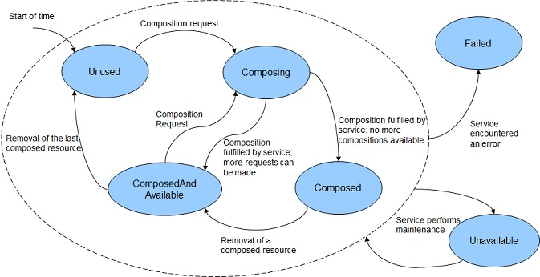

# Foreword

The Redfish Composability White Paper was prepared by the Redfish Forum of the DMTF.

DMTF is a not-for-profit association of industry members dedicated to promoting enterprise and systems management and interoperability. For information about the DMTF, see http://www.dmtf.org.


# Acknowledgments

The DMTF acknowledges the following individuals for their contributions to this document:

* Rafiq Ahamed K - Hewlett Packard Enterprise
* Jeff Autor - Hewlett Packard Enterprise
* Michael Du - Lenovo
* Jeff Hilland - Hewlett Packard Enterprise
* John Leung - Intel Corporation
* Steve Lyle - Hewlett Packard Enterprise
* Michael Raineri - Dell Inc.
* Paul von Behren - Intel Corporation


## Introduction

As the world is transitioning to a software defined paradigm, there is a need for hardware management capabilities to evolve to address that shift in the data center.  In the context of disaggregated hardware, management software needs the ability to conjoin the independent pieces of hardware, such as trays, modules, silicon, etc., together to create a composed logical system.  These logical systems function just like traditional industry standard rackmount systems.  This allows users to dynamically configure their hardware to meet the needs of their workloads.  In addition, users are able to manage the life cycle of their systems, such as adding more compute to their logical system, without having to physically move any equipment.

Redfish is an evolving hardware management standard that is designed to be flexible, extensible, and interoperable.  Redfish contains a data model that is used to describe composable hardware, as well as an interface for clients to manage their compositions.  This document helps implementers and clients understand the Redfish Composability data model as well as how composition requests are expected to be formed.


## Modeling for Composability

If a Redfish service supports Composability, the Service Root resource will contain the `CompositionService` property.  Within the [Composition Service](#composition-service), a client will find the inventory of all components that can be composed into new things ([Resource Blocks](#resource-blocks)), descriptors containing the binding restrictions of the different components ([Resource Zones](#resource-zones)), and annotations informing the client as to how to form composition requests ([Collection Capabilities](#collection-capabilities)).  The following sections detail how these things are reported by a Redfish service.


### Composition Service

The Composition Service is the top level resource for all things related to Composability.  It contains status and control indicator properties such as `Status` and `ServiceEnabled`.  These are common properties found on various Redfish service instances.

The Composition Service contains the `AllowOverprovisioning` property.  This is used to indicate if the service can accept [Constrained Composition](#constrained-composition) requests where the client may allow for more resources than those requested.

The Composition Service contains the `AllowZoneAffinity` property.  This is used to indicate if the service can accept [Constrained Composition](#constrained-composition) requests where the client may desire a given composition request to be fulfilled using [Resource Blocks](#resource-blocks) from a particular [Resource Zones](#resource-zones).

The Composition Service also contains links to its collections of Resource Blocks and Resource Zones through the properties `ResourceBlocks` and `ResourceZones` respectively.  Resource Blocks are described in the [Resource Blocks](#resource-blocks) section, and Resource Zones are described in the [Resource Zones](#resource-zones) section.

Example Composition Service Resource:
```json
{
    "@odata.context": "/redfish/v1/$metadata#CompositionService.CompositionService",
    "@odata.type": "#CompositionService.v1_1_0.CompositionService",
    "@odata.id": "/redfish/v1/CompositionService",
    "Id": "CompositionService",
    "Name": "Composition Service",
    "Status": {
        "State": "Enabled",
        "Health": "OK"
    },
    "ServiceEnabled": true,
    "AllowOverprovisioning": true,
    "AllowZoneAffinity": true,
    "ResourceBlocks": {
        "@odata.id": "/redfish/v1/CompositionService/ResourceBlocks"
    },
    "ResourceZones": {
        "@odata.id": "/redfish/v1/CompositionService/ResourceZones"
    }
}
```


### Resource Blocks

Resource Blocks are the lowest level building blocks for composition requests.  Resource Blocks contain status and control information about the Resource Block instance.  They also contain the list of components found within the Resource Block instance.  For example, if a Resource Block contains 1 Processor and 4 DIMMs, then all of those components will be part of the same composition request, even if only one of them is needed.  In a completely disaggregated system, a client would likely find one component instance within each Resource Block.  Resource Blocks, and their components, are not in a state where system software is able to use them until they belong in a composition.  For example, if a Resource Block contains a Drive instance, the Drive will not belong to any given Computer System until a composition request is made that makes use of its Resource Block.

The property `ResourceBlockType` contains classification information about the types of components found on the Resource Block that can be used to help clients quickly identify a Resource Block.  Each `ResourceBlockType` is associated with specific schema elements, which will be contained within that Resource Block.  For example, if the value `Storage` was found in this property, then a client would know that this particular Resource Block contains storage related devices, such as storage controllers or drives, without having to drill into the individual component resources.  The value `Compute` has special meaning: this is used to describe Resource Blocks that have bound processor and memory components that operate together as a compute subsystem.  The value `Expansion` is also a special indicator that shows a particular Resource Block may have different types of devices over time, such as when a Resource Block contains plug-in cards where a user may replace the components at any time.  `ResourceBlockType` is an array, meaning that it's possible for a Resource Block to have multiple types associated with it.  For example, if the Resource Block in question is a CPU-memory complex, but not a full Computer System, and also has an integrated network controller, `ResourceBlockType` could contain both `Compute` and `Network`.

The property `CompositionStatus` is an object that contains several properties:
* `CompositionState` is used to inform the client of the state of this Resource Block regarding its use in a composition.
* `Reserved` is a writable flag that clients can use to help convey that this Resource Block has been identified by a client, and that the client will be using it for a composition.  If a second client that is attempting to identify resources for a composition sees the `Reserved` flag set to true, the second client should consider it allocated and not use it; the second client should move on to the next Resource Block for further processing.  The Redfish service does not provide any sort of protection with the `Reserved` flag; any client can change its state and it's up to clients to behave fairly.
* `SharingCapable` is a flag to indicate if the Resource Block is capable of participating in multiple compositions simultaneously.
* `SharingEnabled` is a writable flag to indicate if the Resource Block is allowed to participate in multiple compositions simultaneously.
* `MaxCompositions` is used to indicate the maximum number of compositions in which the Resource Block is capable of participating simultaneously.
* `NumberOfCompositions` is used to indicate the number of compositions in which the Resource Block is currently participating.

There are several arrays of links to various component types, such as the `Processors`, `Memory`, and `Storage` arrays.  These links ultimately go to the individual components that are within the Resource Block.  These components are made available to the new composition after a composition request is made.  The `ComputerSystems` array is used when a Resource Block contains one or more whole Computer Systems.  This gives the client the ability to create a single composed Computer System from a set of smaller Computer Systems.

The `Links` property contains references to related resources.  The `Chassis` array contains the Chassis instances that contain the resources within the Resource Block.  The `ComputerSystems` array contains the Computer System instances that are consuming the Resource Block as part of a composition.  The `Zones` array contains links to the [Resource Zones](#resource-zones) that contain the Resource Block.


Example Resource Block Resource:
```json
{
    "@odata.context": "/redfish/v1/$metadata#ResourceBlock.ResourceBlock",
    "@odata.type": "#ResourceBlock.v1_3_0.ResourceBlock",
    "@odata.id": "/redfish/v1/CompositionService/ResourceBlocks/DriveBlock3",
    "Id": "DriveBlock3",
    "Name": "Drive Block 3",
    "ResourceBlockType": [ "Storage" ],
    "Status": {
        "State": "Enabled",
        "Health": "OK"
    },
    "CompositionStatus": {
        "Reserved": false,
        "CompositionState": "ComposedAndAvailable",
        "SharingCapable": true,
        "SharingEnabled": true,
        "MaxCompositions": 8,
        "NumberOfCompositions": 1
    },
    "Processors": [],
    "Memory": [],
    "Storage": [
        {
            "@odata.id": "/redfish/v1/CompositionService/ResourceBlocks/DriveBlock3/Storage/Block3NVMe"
        }
    ],
    "Links": {
        "ComputerSystems": [
            {
                "@odata.id": "/redfish/v1/Systems/ComposedSystem"
            }
        ],
        "Chassis": [
            {
                "@odata.id": "/redfish/v1/Chassis/ComposableModule3"
            }
        ],
        "Zones": [
            {
                "@odata.id": "/redfish/v1/CompositionService/ResourceZones/1"
            },
            {
                "@odata.id": "/redfish/v1/CompositionService/ResourceZones/2"
            }
        ]
    }
}
```

In the above example, the Resource Block is of type `Storage`, and it contains a single storage entity.  From the `CompositionStatus`, it's noted that the Resource Block is currently part of at least one composition and can be used in more compositions, and in the `Links` section, it's being used by the Computer System `ComposedSystem`.


#### Recommended state diagrams for CompositionState

As clients make requests to create or delete composed resources, a Resource Block will transition between different states as shown by the `CompositionState` property within the `CompositionStatus` object.  Figure 1 shows the recommended state diagram for `CompositionState` involving a Resource Block that is not sharable.  Figure 2 shows the recommended state diagram for `CompositionState` involving a Resource Block that is sharable.  While not shown in the diagrams, client requests can fail for precondition checks, such as something not being powered, thus leaving the state unchanged.

|  |
| :--------: |
| *Figure 1* |

|  |
| :--------: |
| *Figure 2* |


### Resource Zones

Resource Zones describe to the client the different composition restrictions of the [Resource Blocks](#resource-blocks) reported by the service; [Resource Blocks](#resource-blocks) that are reported in the same Resource Zone are allowed to be composed together.  This enables the clients to not perform try-and-fail logic to figure out the different restrictions that are in place for a given implementation.  In addition, each Resource Zone leverages the Collection Capabilities annotation to describe what each Resource Zone is able to compose.  This is described in more detail in the [Collection Capabilities](#collection-capabilities) section.

Example Resource Zone Resource:
```json
{
    "@odata.context": "/redfish/v1/$metadata#Zone.Zone",
    "@odata.type": "#Zone.v1_1_0.Zone",
    "@odata.id": "/redfish/v1/CompositionService/ResourceZones/1",
    "Id": "1",
    "Name": "Resource Zone 1",
    "Status": {
        "State": "Enabled",
        "Health": "OK"
    },
    "Links": {
        "ResourceBlocks": [
            {
                "@odata.id": "/redfish/v1/CompositionService/ResourceBlocks/ComputeBlock1"
            },
            {
                "@odata.id": "/redfish/v1/CompositionService/ResourceBlocks/DriveBlock3"
            },
            {
                "@odata.id": "/redfish/v1/CompositionService/ResourceBlocks/DriveBlock4"
            },
            {
                "@odata.id": "/redfish/v1/CompositionService/ResourceBlocks/DriveBlock5"
            },
            {
                "@odata.id": "/redfish/v1/CompositionService/ResourceBlocks/DriveBlock6"
            },
            {
                "@odata.id": "/redfish/v1/CompositionService/ResourceBlocks/DriveBlock7"
            }
        ]
    },
    "@Redfish.CollectionCapabilities": {
        "@odata.type": "#CollectionCapabilities.v1_1_0.CollectionCapabilities",
        "Capabilities": [
            {
                "CapabilitiesObject": {
                    "@odata.id": "/redfish/v1/Systems/Capabilities"
                },
                "UseCase": "ComputerSystemComposition",
                "Links": {
                    "TargetCollection": {
                        "@odata.id": "/redfish/v1/Systems"
                    }
                }
            }
        ]
    }
}
```

In the above example, the Resource Blocks `ComputeBlock1`, `DriveBlock3`, `DriveBlock4`, `DriveBlock5`, `DriveBlock6`, and `DriveBlock7` are all in the same Resource Zone.  In addition, the Collection Capabilities for the Resource Zone shows that this Resource Zone is capable of producing Computer Systems for the collection `/redfish/v1/Systems`.


### Collection Capabilities

Collection Capabilities will be found on [Resource Zones](#resource-zones) and on the Resource Collections themselves.  This is because Collection Capabilities can be applied to things outside of the context of Composability.  Collection Capabilities can be identified by the `@Redfish.CollectionCapabilities` annotation in the response body.  This annotation is used to inform the client how to form the request body for a create (POST) operation to a given collection based on a specified Use Case, which will result in a new member being added to the given collection.


#### Collection Capabilities annotation

Within the Collection Capabilities annotation, there is a single property called `Capabilities`.  This is an array to identify all of the capabilities for a given Resource Zone or Resource Collection.  Inside each instance of the `Capabilities` array is an object to describe a particular capability.

The property `CapabilitiesObject` contains a URI to the underlying object instance that describes the payload format.  This is described further in the [next section](#collection-capabilities-object).

The property `UseCase` is used to inform the client of the context of a particular create (POST) operation.  The table below shows the different values for `UseCase` as used by Composability.  Each value corresponds with a specific type of resource being composed in addition to a [type of composition](#types-of-compositions) for the request.

| `UseCase` Value                        | Composed Resource | Type of Composition |
| -------------------------------------- | ----------------- | ------------------- |
| `ComputerSystemComposition`            | `ComputerSystem`  | [Specific](#specific-composition) |
| `ComputerSystemConstrainedComposition` | `ComputerSystem`  | [Constrained](#constrained-composition) |

The property `TargetCollection` inside the `Links` object contains the URI of the Resource Collection that accepts the given capability.  A client will be able to perform a create (POST) operation against this URI as described by the contents of the `CapabilitiesObject`.

Example Collection Capabilities annotation:
```json
{
    "@Redfish.CollectionCapabilities": {
        "@odata.type": "#CollectionCapabilities.v1_1_0.CollectionCapabilities",
        "Capabilities": [
            {
                "CapabilitiesObject": {
                    "@odata.id": "/redfish/v1/Systems/Capabilities"
                },
                "UseCase": "ComputerSystemComposition",
                "Links": {
                    "TargetCollection": {
                        "@odata.id": "/redfish/v1/Systems"
                    }
                }
            },
            {
                "CapabilitiesObject": {
                    "@odata.id": "/redfish/v1/Systems/ConstrainedCompositionCapabilities"
                },
                "UseCase": "ComputerSystemConstrainedComposition",
                "Links": {
                    "TargetCollection": {
                        "@odata.id": "/redfish/v1/Systems"
                    }
                }
            }
        ]
    },
    ...
}
```

The above annotation contains two capabilities.  In the first capability object, the `UseCase` property shows that this capability describes how to form a create (POST) request to create a new Computer System from a set of specific Resource Blocks.  In addition, the `TargetCollection` property indicates that a client can make the request to the Resource Collection `/redfish/v1/Systems`; new instances of the resource created by the client will be found in that collection.  In the second capability object, the `UseCase` property shows that this capability describes how to form a create (POST) request to create a new Computer System from a set of constraints.


#### Collection Capabilities Object

The Collection Capabilities Object follows the schema of the new resource a client is able to create.  For example, if the object is describing how to form a request to create a new Computer System instance, then the object's type will be `ComputerSystem.vX_Y_Z.ComputerSystem`, where `vX_Y_Z` is the version of `ComputerSystem` supported by the service.

The object itself contains annotated properties the client can use in the body of the create (POST) operation.  It also lists out optional properties, and any restrictions properties may have after the new resource is created.  The table below describes the different annotations used on the properties within the Collection Capabilities Object.

| Property Annotation             | Description |
| ------------------------------- | ----------- |
| `@Redfish.RequiredOnCreate`     | The client must provide the given property in the body of the create (POST) request |
| `@Redfish.OptionalOnCreate`     | The client may provide the property in the body of the create (POST) request |
| `@Redfish.SetOnlyOnCreate`      | If the client has a specific value needed for the property, it must be provided in the body of the create (POST) request; this property is likely a "Read Only" property after the resource's creation |
| `@Redfish.UpdatableAfterCreate` | The client is allowed to update the property after the resource is created |
| `@Redfish.AllowableValues`      | The client is allowed to use any of the specified values in the body of the create (POST) request for the given property |

In the above table, some of the annotation terms can conflict with one another if used incorrectly.  This may be due to conflicting logical semantics with the term definitions.  Services need to ensure their Collection Capabilities Objects do not have the following types of conflicts:
* Do not annotate a property with both `@Redfish.RequiredOnCreate` and `@Redfish.OptionalOnCreate`.  A property cannot be both required and optional.
* Do not annotate a property with both `@Redfish.SetOnlyOnCreate` and `@Redfish.UpdatableAfterCreate`.  A property can only be one of these.

The object can also contain object level annotations to describe other types of payload rules to the client.  The table below describes the different annotations used at the object level within the Collection Capabilities Object.

| Object Annotation                 | Description |
| ----------------------------------| ----------- |
| `@Redfish.RequestedCountRequired` | Indicates that the client is required to annotate the corresponding object in the request payload with `@Redfish.RequestedCount` to show how many instances of the object the client is requesting |
| `@Redfish.ResourceBlockLimits`    | Indicates any restrictions regarding quantities of Resource Blocks of a given type in a given composition request. |

Example Collection Capabilities Object:
```json
{
    "@odata.context": "/redfish/v1/$metadata#ComputerSystem.ComputerSystem",
    "@odata.type": "#ComputerSystem.v1_4_0.ComputerSystem",
    "@odata.id": "/redfish/v1/Systems/Capabilities",
    "Id": "Capabilities",
    "Name": "Capabilities for the Zone",
    "Name@Redfish.RequiredOnCreate": true,
    "Name@Redfish.SetOnlyOnCreate": true,
    "Description@Redfish.OptionalOnCreate": true,
    "Description@Redfish.SetOnlyOnCreate": true,
    "HostName@Redfish.OptionalOnCreate": true,
    "HostName@Redfish.UpdatableAfterCreate": true,
    "Boot@Redfish.OptionalOnCreate": true,
    "Boot": {
        "BootSourceOverrideEnabled@Redfish.OptionalOnCreate": true,
        "BootSourceOverrideEnabled@Redfish.UpdatableAfterCreate": true,
        "BootSourceOverrideTarget@Redfish.OptionalOnCreate": true,
        "BootSourceOverrideTarget@Redfish.UpdatableAfterCreate": true,
        "BootSourceOverrideTarget@Redfish.AllowableValues": [
            "None",
            "Pxe",
            "Usb",
            "Hdd"
        ]
    },
    "Links@Redfish.RequiredOnCreate": true,
    "Links": {
        "ResourceBlocks@Redfish.RequiredOnCreate": true,
        "ResourceBlocks@Redfish.UpdatableAfterCreate": true
    },
    "@Redfish.ResourceBlockLimits": {
        "MinCompute": 1,
        "MaxCompute": 1,
        "MaxStorage": 8
    }
}
```

In the above example, three properties are marked with the `Redfish.RequiredOnCreate` annotation: `Name`, `Links`, and `ResourceBlocks` inside of `Links`.  All other properties are annotated with `Redfish.OptionalOnCreate`.  However, both `Name` and `Description` are annotated with `Redfish.SetOnlyOnCreate`, meaning they cannot be modified after the new resource is created.  The response also tells us in the `@Redfish.ResourceBlockLimits` annotation that all requests must have exactly 1 Resource Block of type Compute, and can up have to 8 Resource Blocks of type Storage.


## Types of Compositions

The Redfish Composability data model provides flexibility for service implementers to report different Composition Types based on their needs.  The service informs the client of the type of composition request based on the `UseCase` property found in the [Collection Capabilities Annotation](#collection-capabilities-annotation).  The existing Redfish Composability model has defined two types called [Specific Composition](#specific-composition) and [Constrained Composition](#constrained-composition).


### Specific Composition

The Specific Composition allows clients to create and manage the life cycle of composed resources through predefined [Resource Blocks](#resource-blocks) and [Resource Zones](#resource-zones).  Since Resource Blocks are self contained entities within a Resource Zone, clients are able to pick and choose specific Resource Blocks for their composition request.

An example of choosing a Resource Block according to the binding rules and providing details of specific Resource Blocks in the a create (POST) request can be found in the [Create a Composed Resource](#create-a-composed-resource) section.

Another industry standard server design that fits into the example of Specific Composition is defined in the [Bladed Partitions Mockup](#references).  In this example, a Multi-Blade Enclosure consisting of a disaggregated hardware chassis can be bound together to create what are called [partitioned servers](http://www.computerworld.com/article/2593387/server-partitioning.html).  These partitions can be composed using the Specific Composition.  The Redfish service implements each blade within the enclosure as a Resource Block with `ResourceBlockType` set to either `Compute` or `Storage`, and allows the clients to combine multiple Resource Blocks to create a composed Computer System, which is a partitioned server.

Example Create (POST) Body for a Specific Composition:
```json
{
    "Name": "Sample Composed System",
    "Links": {
        "ResourceBlocks": [
            { "@odata.id": "/redfish/v1/CompositionService/ResourceBlocks/BladeComputeBlock1" },
            { "@odata.id": "/redfish/v1/CompositionService/ResourceBlocks/BladeComputeBlock5" },
            { "@odata.id": "/redfish/v1/CompositionService/ResourceBlocks/BladeStorageBlock8" }
        ]
    }
}
```


### Constrained Composition

The Constrained Composition allows clients to request a composition by specifying the number and characteristics of the components to assemble into a composition.  The selection of the Resource Blocks is delegated by client to the Composition Service.  An example of this type of composition can be found in the [Constrained Composition Workflow](#constrained-composition-workflow) section.


### Expandable Resources

In some cases, clients may not be able to directly compose new resources.  Instead, the service may have a baseline resource, and the client is only able to add additional components, or remove them.  A client can identify this case if the Allow HTTP header for the resource does not contain the DELETE method, as well as using other indicators in the resource itself.

Example Expandable ComputerSystem:
Client request example:
```http
GET /redfish/v1/Systems/1 HTTP/1.1
Content-Type: application/json; charset=utf-8
Content-Length: <computed-length>
OData-Version: 4.0
Allow: GET, PATCH, PUT, HEAD
{
    "Id": "1"
    "Name": "Sample Expandable System",
    "SystemType": "Physical",
    "Links": {
        "ResourceBlocks": [
            { "@odata.id": "/redfish/v1/CompositionService/ResourceBlocks/ComputerSystemBlock0" }
        ]
    },
    ...
}
```

In the above example, the client performed a GET on `/redfish/v1/Systems/1`.  The response shows that it's a physical system since the `SystemType` is set to `Physical`.  However, the presence of the `ResourceBlocks` array in the `Links` property indicates that a client is able to add or remove components.  In addition, the Allow header does not contain DELETE as one of the available methods.  The client is only allowed to update the allocated resources using PATCH or PUT.  An example of how to allocate additional resources can be found in the [Modify a Composed Resource](#modify-a-composed-resource) section.


## Appendix


### Workflows for a client making a Composition Request

There are two workflows for a client to make a compostion request: a specific composition workflow and a constrained composition workflow.

Here are the operations that a client is expected to use during the creation and management of Composed Systems using the Redfish Composition models.  The examples below expect the client will have a valid Redfish Session or Basic Authentication header.


#### Identify whether Redfish service supports Composition

Application code should always start at the root: `/redfish/v1/`

1. Read the Service Root Resource.
    1. Find the `CompositionService` property.
    2. Perform a GET on the URI given by that property.
    3. Look for the value of `ServiceEnabled` attribute to be true.

General flow diagram:
```
Client|                                              | Redfish Service
      |---- GET /redfish/v1/CompositionService ----->|
      |<--- { ..., "ServiceEnabled": true, ... } <---|
```


#### Specific Composition workflow

The client needs to understand the composition model reported by the [Composition Service](#composition-service) by reading the [Resource Blocks](#resource-blocks) and [Resource Zones](#resource-zones) collections.  This relationship will be used to execute the reported `UseCase` supported by the Redfish service described later in the [Create a Composed Resource](#create-a-composed-resource) section.


##### Read the Resource Blocks

1. Perform a GET on the Composition Service URI.
2. Look for the `ResourceBlocks` property.
3. Perform a GET on that URI to get a list of all Resource Blocks.
4. For accessing details of a particular Resource Block, perform a GET on the associated URI listed for a given entry in the `Members` array.
5. The `CompositionStatus` property in each Resource Block will identify the availability of the Resource Block in composition requests.
    * Clients should take note of this when making decisions on what Resource Blocks to use in a composition request.
    * Depending on what's contained in the `CompositionStatus` property, a given Resource Block may not be currently available for composition.

Resource Block Collection sample:
```json
{
    "@odata.type": "#ResourceBlockCollection.ResourceBlockCollection",
    "@odata.id": "/redfish/v1/CompositionService/ResourceBlocks",
    "Name": "Resource Block Collection",
    "Members@odata.count": 9,
    "Members": [
        { "@odata.id": "/redfish/v1/CompositionService/ResourceBlocks/ComputeBlock1" },
        { "@odata.id": "/redfish/v1/CompositionService/ResourceBlocks/ComputeBlock2" },
        { "@odata.id": "/redfish/v1/CompositionService/ResourceBlocks/DriveBlock3" },
        { "@odata.id": "/redfish/v1/CompositionService/ResourceBlocks/DriveBlock4" },
        { "@odata.id": "/redfish/v1/CompositionService/ResourceBlocks/DriveBlock5" },
        { "@odata.id": "/redfish/v1/CompositionService/ResourceBlocks/DriveBlock6" },
        { "@odata.id": "/redfish/v1/CompositionService/ResourceBlocks/DriveBlock7" },
        { "@odata.id": "/redfish/v1/CompositionService/ResourceBlocks/NetworkBlock8" },
        { "@odata.id": "/redfish/v1/CompositionService/ResourceBlocks/OffloadBlock9" }
    ]
}
```


##### Read the Resource Zones

1. Perform a GET on the Composition Service URI.
2. Look for the `ResourceZones` property.
3. Perform a GET on that URI to get a list of all Resource Zones.
4. For accessing details of a particular Resource Zone, perform a GET on the associated URI listed for a given entry in the `Members` array.

Resource Zone Collection Sample:
```json
{
    "@odata.type": "#ZoneCollection.ZoneCollection",
    "@odata.id": "/redfish/v1/CompositionService/ResourceZones",
    "Name": "Resource Zone Collection",
    "Members@odata.count": 2,
    "Members": [
        { "@odata.id": "/redfish/v1/CompositionService/ResourceZones/1" },
        { "@odata.id": "/redfish/v1/CompositionService/ResourceZones/2" }
    ]
}
```


##### Read the capabilities for each Resource Zone

1. Perform a GET on each Resource Zone using the URI found in each entry of the `Members` array.
2. Look for the `@Redfish.CollectionCapabilities` annotation in each Resource Zone.
    * The `UseCase` property will be used later when a client has determined what type of composition to create.
    * The `TargetCollection` property will be used later for making the composition request.

Resource Zone Capabilities Sample:
```json
{
    "@odata.context": "/redfish/v1/$metadata#Zone.Zone",
    "@odata.type": "#Zone.v1_1_0.Zone",
    "@odata.id": "/redfish/v1/CompositionService/ResourceZones/1",
    "Id": "1",
    "Name": "Resource Zone 1",
    "Status": {},
    "Links": {},
    "@Redfish.CollectionCapabilities": {
        "@odata.type": "#CollectionCapabilities.v1_1_0.CollectionCapabilities",
        "Capabilities": [
            {
                "CapabilitiesObject": { "@odata.id": "/redfish/v1/Systems/Capabilities" },
                "UseCase":"ComputerSystemComposition",
                "Links": {
                    "TargetCollection": { "@odata.id": "/redfish/v1/Systems" },
                    "RelatedItem": [
                        { "@odata.id": "/redfish/v1/CompositionService/ResourceZones/1" }
                    ]
                }
            }
        ]
    }
}
```


##### Read each Capabilities Object

1. Perform a GET on the URI listed in the `CapabilitiesObject` property for each of the Capabilities.

Capabilities Object Sample for a Specific Composition:
```json
{
    "@odata.context": "/redfish/v1/$metadata#ComputerSystem.ComputerSystem",
    "@odata.type": "#ComputerSystem.v1_4_0.ComputerSystem",
    "@odata.id": "/redfish/v1/Systems/Capabilities",
    "Id": "Capabilities",
    "Name": "Capabilities for the Zone",
    "Name@Redfish.RequiredOnCreate": true,
    "Name@Redfish.SetOnlyOnCreate": true,
    "Description@Redfish.OptionalOnCreate": true,
    "Description@Redfish.SetOnlyOnCreate": true,
    "HostName@Redfish.OptionalOnCreate": true,
    "HostName@Redfish.UpdatableAfterCreate": true,
    "Boot@Redfish.OptionalOnCreate": true,
    "Boot": {
        "BootSourceOverrideEnabled@Redfish.OptionalOnCreate": true,
        "BootSourceOverrideEnabled@Redfish.UpdatableAfterCreate": true,
        "BootSourceOverrideTarget@Redfish.OptionalOnCreate": true,
        "BootSourceOverrideTarget@Redfish.UpdatableAfterCreate": true,
        "BootSourceOverrideTarget@Redfish.AllowableValues": [
            "None",
            "Pxe",
            "Usb",
            "Hdd"
        ]
    },
    "Links@Redfish.RequiredOnCreate": true,
    "Links": {
        "ResourceBlocks@Redfish.RequiredOnCreate": true,
        "ResourceBlocks@Redfish.UpdatableAfterCreate": true
    },
    "@Redfish.ResourceBlockLimits": {
        "MinCompute": 1,
        "MaxCompute": 1,
        "MaxStorage": 8
    }
}
```


##### Create a Composed Resource

The client builds a specific composition request with the following steps.

1. List all [Resource Blocks](#resource-blocks) that belong to a particular [Resource Zone](#resource-zones) by doing a GET on their collection URIs as described in [the above example](#read-the-resource-blocks).
    * When reading the Resource Blocks, take note of the `CompositionStatus` property.
    * Depending on what's contained in the `CompositionStatus` property, a given Resource Block may not be currently available for composition.
2. (Optional) Reserve each Resource Block that has been identified for the composition request.
    * Perform a PATCH on each Resource Block with `Reserved` set to true.
    * This step should be done in scenarios where multiple clients may be making composition requests.
3. Identify the needs of a specific composition `UseCase`.
    * Perform a GET on the desired Resource Zone.
    * Find the matching `UseCase` value in the `@Redfish.CollectionCapabilities` annotation.
        * For example, look for the value `ComputerSystemComposition` if trying to compose a new Computer System from a specific list of Resource Blocks.
    * Perform a GET on the URI found in the property `CapabilitiesObject`.
    * Mark down all of the properties annotated with `RequiredOnCreate`.
        * These are the properties that need to be passed as part of the composition request.
    * Mark down the `TargetCollection` URI.
        * This is where the create (POST) request for the new composition is made.
4. Using all the properties that were annotated with `RequiredOnCreate`, build a create (POST) request body that will be sent to the `TargetCollection` URI.
    * In step 4 of [the above example](#read-the-resource-blocks), only `Name` and `ResourceBlocks` found in `Links` are required.
    * The Redfish service may accept other properties as part of the request so they do not need to be updated later.
5. The `Location` HTTP header in the service response contains the URI of the composed resource.

General flow diagram:
```
Client  |                                                                     | Redfish Service
        |---> GET /redfish/v1/CompositionService/ResourceZones/1 ------------>|
        |<--- { ..., "UseCase": "ComputerSystemComposition", ... } <----------|
        |                                                                     |
        |---> GET /redfish/v1/Systems/Capabilities -------------------------->|
        |     {   ...,                                             <----------|
        |         "Name@Redfish.RequiredOnCreate": true,                      |
        |         "ResourceBlocks@Redfish.RequiredOnCreate": true,            |
        |         ...                                                         |
        |<--- }                                                               |
        |                                                                     |
        |           ( << Identify which Resource Blocks to use >> )           |
        |                                                                     |
        |-> GET /redfish/v1/CompositionService/ResourceBlocks/ComputeBlock2 ->|
        |<--- { ..., "CompositionState": "Unused", "Reserved": false ... } <--|
        |                                                                     |
        |-> PATCH /redfish/v1/CompositionService/ResourceBlocks/ComputeBlock2 |
        |   { "CompositionStatus": { "Reserved": true } } ------------------->|
```

Client request example:
```http
POST /redfish/v1/Systems HTTP/1.1
Content-Type: application/json; charset=utf-8
Content-Length: <computed-length>
OData-Version: 4.0
{
    "Name": "Sample Composed System",
    "Links": {
        "ResourceBlocks": [
            { "@odata.id": "/redfish/v1/CompositionService/ResourceBlocks/ComputeBlock0" },
            { "@odata.id": "/redfish/v1/CompositionService/ResourceBlocks/DriveBlock2" }
        ]
    }
}
```

Service Response example:
```http
HTTP/1.1 201 Created
Content-Type: application/json; charset=utf-8
Content-Length: <computed-length>
Location: /redfish/v1/Systems/NewSystem
```

The above Client Request Example shows a specific composition request by the client being made to the Computer System Collection found at `/redfish/v1/Systems`.  In the request, the client is creating a new Computer System using the Resource Blocks `ComputeBlock0` and `DriveBlock2`.  In the above Service Response Example, the service responded with a successful 201 response, and indicated that the new Computer System can be found at `/redfish/v1/Systems/NewSystem`.


#### Constrained Composition Workflow

Here are the operations that a client is expected to use during the creation and management of Composed Systems using the Redfish Composition models.  The examples below expect the client will have a valid Redfish Session or Basic Authentication header.


##### Determine the Provisioning Capabilities of the Service

1. Perform a GET on the Composition Service URI.
2. Look for the `AllowOverprovisioning` property.
    * If this property is missing or set to `false`, `@Redfish.AllowOverprovisioning` is not allowed to be supplied in the composition request.
3. Look for the `AllowZoneAffinity` property.
    * If this property is missing or set to `false`, `@Redfish.ZoneAffinity` is not allowed to be supplied in the composition request.


##### Read the Capabilities Object

Perform a GET on the URI listed in the `CapabilitiesObject` property whose `UseCase` property has the value `ComputerSystemConstrainedComposition`.

Capabilities Object Sample for a Constrained Composition:
```json
{
    "@odata.context": "/redfish/v1/$metadata#ComputerSystem.ComputerSystem",
    "@odata.type": "#ComputerSystem.v1_4_0.ComputerSystem",
    "@odata.id": "/redfish/v1/Systems/ConstrainedCompositionCapabilities",
    "Id": "ConstrainedCompositionCapabilities",
    "Name": "Capabilities for the Zone",
    "Name@Redfish.RequiredOnCreate": true,
    "Name@Redfish.SetOnlyOnCreate": true,
    "Description@Redfish.OptionalOnCreate": true,
    "Description@Redfish.SetOnlyOnCreate": true,
    "HostName@Redfish.OptionalOnCreate": true,
    "HostName@Redfish.UpdatableAfterCreate": true,
    "Boot@Redfish.OptionalOnCreate": true,
    "Boot": {
        "BootSourceOverrideEnabled@Redfish.OptionalOnCreate": true,
        "BootSourceOverrideEnabled@Redfish.UpdatableAfterCreate": true,
        "BootSourceOverrideTarget@Redfish.OptionalOnCreate": true,
        "BootSourceOverrideTarget@Redfish.UpdatableAfterCreate": true,
        "BootSourceOverrideTarget@Redfish.AllowableValues": [
            "None",
            "Pxe",
            "Usb",
            "Hdd"
        ]
    },
    "Processors@Redfish.RequiredOnCreate": true,
    "Processors": {
        "@odata.type": "#ProcessorCollection.ProcessorCollection",
        "Members@Redfish.RequiredOnCreate": true,
        "Members": [
            {
                "@odata.type": "#Processor.v1_1_0.Processor",
                "@Redfish.RequestedCountRequired": true,
                "ProcessorType@Redfish.RequiredOnCreate": true,
                "TotalCores@Redfish.RequiredOnCreate": true,
                "Model@Redfish.OptionalOnCreate": true,
                "InstructionSet@Redfish.OptionalOnCreate": true,
                "AchieveableSpeedMHz@Redfish.OptionalOnCreate": true
            }
        ]
    },
    "Memory@Redfish.RequiredOnCreate": true,
    "Memory": {
        "@odata.type": "#MemoryCollection.MemoryCollection",
        "Members@Redfish.RequiredOnCreate": true,
        "Members": [
            {
                "@odata.type": "#Memory.v1_1_0.Memory",
                "@Redfish.RequestedCountRequired": true,
                "MemoryType@Redfish.RequiredOnCreate": true,
                "MemoryDeviceType@Redfish.OptionalOnCreate": true,
                "CapacityMiB@Redfish.RequiredOnCreate": true,
                "SpeedMHz@Redfish.OptionalOnCreate": true,
                "DataWidthBits@Redfish.OptionalOnCreate": true,
                "BusWidthBits@Redfish.OptionalOnCreate": true
            }
        ]
    },
    "SimpleStorage@Redfish.OptionalOnCreate": true,
    "SimpleStorage": {
        "@odata.type": "#SimpleStorageCollection.SimpleStorageCollection",
        "Members@Redfish.RequiredOnCreate": true,
        "Members": [
            {
                "@odata.type": "#SimpleStorage.v1_2_0.SimpleStorage",
                "@Redfish.RequestedCountRequired": true,
                "Devices@Redfish.RequiredOnCreate": true,
                "Devices": {
                    "@Redfish.RequestedCountRequired": true,
                    "CapacityBytes@Redfish.RequiredOnCreate": true
                }
            }
        ]
    },
    "Storage@Redfish.OptionalOnCreate": true,
    "Storage": {
        "@odata.type": "#StorageCollection.StorageCollection",
        "Members@Redfish.RequiredOnCreate": true,
        "Members": [
            {
                "@odata.type": "#Storage.v1_3_0.Storage",
                "@Redfish.RequestedCountRequired": true,
                "StorageControllers@Redfish.OptionalOnCreate": true,
                "StorageControllers": [
                    {
                        "@Redfish.RequestedCountRequired": true,
                        "SupportedControllerProtocols@Redfish.RequiredOnCreate": true
                    }
                ],
                "Drives@Redfish.RequiredOnCreate": true,
                "Drives": [
                    {
                        "@odata.type": "#Drive.v1_2_0.Drive",
                        "@Redfish.RequestedCountRequired": true,
                        "CapacityBytes@Redfish.RequiredOnCreate": true
                    }
                ]
            }
        ]
    },
    "EthernetInterfaces@Redfish.OptionalOnCreate": true,
    "EthernetInterfaces": {
        "@odata.type": "#EthernetInterfaceCollection.EthernetInterfaceCollection",
        "Members@Redfish.RequiredOnCreate": true,
        "Members": [
            {
                "@odata.type": "#EthernetInterface.v1_3_0.EthernetInterface",
                "@Redfish.RequestedCountRequired": true,
                "SpeedMbps@Redfish.RequiredOnCreate": true,
                "FullDuplex@Redfish.OptionalOnCreate": true
            }
        ]
    },
    "NetworkInterfaces@Redfish.OptionalOnCreate": true,
    "NetworkInterfaces": {
        "@odata.type": "#NetworkInterfaceCollection.NetworkInterfaceCollection",
        "Members@Redfish.RequiredOnCreate": true,
        "Members": [
            {
                "@odata.type": "#NetworkInterface.v1_1_0.NetworkInterface",
                "@Redfish.RequestedCountRequired": true,
                "NetworkPorts@Redfish.RequiredOnCreate": true,
                "NetworkPorts": {
                    "@odata.type": "#NetworkPortCollection.NetworkPortCollection",
                    "Members@Redfish.RequiredOnCreate": true,
                    "Members": [
                        {
                            "@odata.type": "#NetworkPort.v1_1_0.NetworkPort",
                            "@Redfish.RequestedCountRequired": true,
                            "ActiveLinkTechnology@Redfish.RequiredOnCreate": true,
                            "SupportedLinkCapabilities@Redfish.OptionalOnCreate": true,
                            "SupportedLinkCapabilities": {
                                "LinkSpeedMbps@Redfish.RequiredOnCreate": true
                            }
                        }
                    ]
                }
            }
        ]
    }
}
```

In the above example, it should be noted that the general structure of the capabilities object for a constrained composition is an expanded object that represents the resource the client can compose.  In this case, the properties `Processors` and `Memory` are expanded, and showing Processor Collection and Memory Collection representations respectively.  These expanded objects do not contain extraneous information required under normal circumstances, such as `@odata.id`, in order to reduce the information to only what the client requires to form the composition request.


##### Create the Composition Request

In a constrained composition request, the request includes structures for the processors, memory, storage and network interfaces.  Each structure includes the annotation `@Redfish.RequestedCount`, which specifies the requested amount of a resource.

Based on the capabilities example in [the previous section](#read-the-capabilities-object), the following structures can contain an enumeration annotation and may required sub-properties.

* The processors request
    * The `@Redfish.RequestedCount` is required.
    * The `ProcessorType` and `TotalCores` properties are required.
* The memory request
    * The `@Redfish.RequestedCount` is required.
    * The `MemoryType` and `CapacityMiB` properties are required.
* The storage request
    * The `@Redfish.RequestedCount` is required.
    * Either the `SimpleStorage` or `Storage` property may be present, or neither.
    * If present, `CapacityBytes` property is required.
* The network interface request
    * The `@Redfish.RequestedCount` is required.
    * Either `EthernetInterfaces` or `NetworkInterfaces` property may be present, or neither.
    * If present, `SpeedMbps` or `LinkSpeedMbps` properties are required.

For example, the following processor request requests 4 CPUs and 2 FPGAs.  Other properties in the request can further characterize the processor resource.

The composition request should be kept simple in order to increase the probability of a successful composition.  Overly-constrained requests are less likely to be fulfilled.

Sample Request Payload for Describing Sets of Processors:
```json
{
    "Processors": {
        "Members": [
            {
                "@Redfish.RequestedCount": 4,
                "ProcessorType": "CPU",
                "TotalCores": 16
            },
            {
                "@Redfish.RequestedCount": 2,
                "ProcessorType": "FPGA",
                "TotalCores": 16
            }
        ]
    }
}
```


##### Make the composition request

POST the request to the `TargetCollection` URI.

Client Request Example:
```http
POST /redfish/v1/Systems HTTP/1.1
Content-Type: application/json; charset=utf-8
Content-Length: <computed-length>
OData-Version: 4.0
{
    "Name": "My Computer System",
    "Description": "Description of server",
    "@Redfish.ZoneAffinity": "1",
    "PowerState": "On",
    "BiosVersion": "P79 v1.00 (09/20/2013)",
    "Processors": {
        "Members": [
            {
                "@Redfish.RequestedCount": 4,
                "@Redfish.AllowOverprovisioning": true,
                "ProcessorType": "CPU",
                "ProcessorArchitecture": "x86",
                "InstructionSet": "x86-64",
                "MaxSpeedMHz": 3700,
                "TotalCores": 8,
                "TotalThreads": 16
            },
            {
                "@Redfish.RequestedCount": 4,
                "@Redfish.AllowOverprovisioning": false,
                "ProcessorType": "FPGA",
                "ProcessorArchitecture": "x86",
                "InstructionSet": "x86-64",
                "MaxSpeedMHz": 3700,
                "TotalCores": 16
            }
        ]
    },
    "Memory": {
        "Members": [
            {
                "@Redfish.RequestedCount": 4,
                "MaxTDPMilliWatts": [ 12000 ],
                "CapacityMiB": 8192,
                "DataWidthBits": 64,
                "BusWidthBits": 72,
                "ErrorCorrection": "MultiBitECC",
                "MemoryType": "DRAM",
                "MemoryDeviceType": "DDR4",
                "BaseModuleType": "RDIMM",
                "MemoryMedia": [ "DRAM" ]
            }
        ]
    },
    "SimpleStorage": {
        "Members" : [
            {
                "@Redfish.RequestedCount": 6,
                "Devices": [
                    {
                        "CapacityBytes": 322122547200
                    }
                ]
            }
        ]
    },
    "EthernetInterfaces": {
        "Members": [
            {
                "@Redfish.RequestedCount": 1,
                "SpeedMbps": 1000,
                "FullDuplex": true,
                "NameServers": [
                    "names.redfishspecification.org"
                ],
                "IPv4Addresses": [
                    {
                        "SubnetMask": "255.255.252.0",
                        "AddressOrigin": "Dynamic",
                        "Gateway": "192.168.0.1"
                    }
                ]
            }
        ]
    }
}
```

Service Response example:
```http
HTTP/1.1 201 Created
Content-Type: application/json; charset=utf-8
Content-Length: <computed-length>
Location: /redfish/v1/Systems/NewSystem2
```

The above Client Request Example shows a composition request by the client being made to the Computer System Collection found at `/redfish/v1/Systems`.  In the request, the client is requesting a new Computer System with 4 CPUs, 4 FPGAs, 4 GB of memory, 6 322GB local drives, and a 1GB Ethernet interface.  The setting of the annotation `@Redfish.AllowOverprovisioning` permits the Redfish service to supply more resources than what was requested.  The usage of the annotation `@Redfish.ZoneAffinity` indicates the client wants the components for the composition to be all selected from the [Resource Zone](#resource-zones) that contains the value `"1"` for the `Id` property.

In the above Service Response Example, the service responded with a successful 201 response, and indicates that the new Computer System can be found at `/redfish/v1/Systems/NewSystem2`.


#### Modify a Composed Resource

If the Redfish service supports updating an existing composition, the client can do so either by using PUT/PATCH on the composed resource, or by using actions on the composed resource.


##### PUT/PATCH method for modifying

The PUT/PATCH method can be done by updating the `ResourceBlocks` array found in the composed resource.  When using PATCH, the same array semantics apply as described in the Redfish Specification.

Client Request Example:
```http
PATCH /redfish/v1/Systems/NewSystem HTTP/1.1
Content-Type: application/json; charset=utf-8
Content-Length: <computed-length>
OData-Version: 4.0
{
    "Links": {
        "ResourceBlocks": [
            {},
            {},
            { "@odata.id": "/redfish/v1/CompositionService/ResourceBlocks/NetworkBlock8" }
        ]
    }
}
```

The above example will preserve the existing Resource Blocks in the composed resource for array elements 0 and 1, and it will add the `NetworkBlock8` Resource Block to array element 2.


##### Actions for modifying

Composed resources that support using actions for modification will have them advertised in the GET response for the resource.

Sample ComputerSystem with Modification Actions
```json
{
    "@odata.id": "/redfish/v1/Systems/ComposedSystem",
    "Id": "ComposedSystem",
    "Name": "Sample Composed System",
    "SystemType": "Composed",
    "Links": {
        "ResourceBlocks": [
            {
                "@odata.id": "/redfish/v1/CompositionService/ResourceBlocks/ComputeBlock1"
            },
            {
                "@odata.id": "/redfish/v1/CompositionService/ResourceBlocks/DriveBlock3"
            },
            {
                "@odata.id": "/redfish/v1/CompositionService/ResourceBlocks/DriveBlock4"
            }
        ]
    },
    "Actions": {
        "#ComputerSystem.AddResourceBlock": {
            "target": "/redfish/v1/Systems/ComposedSystem/Actions/ComputerSystem.AddResourceBlock"
        },
        "#ComputerSystem.RemoveResourceBlock": {
            "target": "/redfish/v1/Systems/ComposedSystem/Actions/ComputerSystem.RemoveResourceBlock"
        }
    },
    ...
}
```

In the above example, the Computer System `ComposedSystem` supports two actions: `ComputerSystem.AddResourceBlock` and `ComputerSystem.RemoveResourceBlock`.  A client is able to modify the Computer System by issuing POST to the URI specified by the `target` properties.

Example AddResourceBlock Request:
```http
POST /redfish/v1/Systems/ComposedSystem/Actions/ComputerSystem.AddResourceBlock HTTP/1.1
Content-Type: application/json; charset=utf-8
Content-Length: <computed-length>
OData-Version: 4.0
{
    "ResourceBlock": {
        "@odata.id": "/redfish/v1/CompositionService/ResourceBlocks/NetworkBlock8"
    },
    "ResourceBlockETag": "6e83d4d5f1b8d93fed866876a220c0ab",
    "ComputerSystemETag": "31171b07d6e2733c8368c54ab1857456"
}
```

In the above example, the client is making a request to add `NetworkBlock8` to the Computer System `ComposedSystem`.  It also uses the optional parameters `ResourceBlockETag` and `ComputerSystemETag` to help protect the usage of the Computer System and Resource Block in multi-client scenarios so that the action is not carried out of if the specified ETags do not match the state of the resources.


#### Delete a Composed Resource

The client can retire or decompose an already composed resource by using DELETE.

Client Request Example:
```http
DELETE /redfish/v1/Systems/NewSystem HTTP/1.1
```

The above example will request that the composed system called `NewSystem` be retired.  When this happens, this will free the Resource Blocks being used by the system so that they can be used in future compositions.  However, the `Reserved` flag found in the `CompositionStatus` for each Resource Block will remain in the same state; if a client is done using the Resource Blocks, it should set the `Reserved` flag to false.


### References

* "Composable System" and "Bladed Partitions" Mockups: [http://redfish.dmtf.org/redfish/v1](http://redfish.dmtf.org/redfish/v1)
* Composition Service Schema: [http://redfish.dmtf.org/schemas/v1/CompositionService_v1.xml](http://redfish.dmtf.org/schemas/v1/CompositionService_v1.xml)
* Resource Block Schema: [http://redfish.dmtf.org/schemas/v1/ResourceBlock_v1.xml](http://redfish.dmtf.org/schemas/v1/ResourceBlock_v1.xml)
* Resource Zone Schema: [http://redfish.dmtf.org/schemas/v1/Zone_v1.xml](http://redfish.dmtf.org/schemas/v1/Zone_v1.xml)
* Collection Capabilities Schema: [http://redfish.dmtf.org/schemas/v1/CollectionCapabilities_v1.xml](http://redfish.dmtf.org/schemas/v1/CollectionCapabilities_v1.xml)


### Change log

| Version | Date       | Description |
| ------- | ---------- | ----------- |
| 1.2.1   | TBD        | Clarified how `ResourceBlockType` is an array and can represent a mix of devices. |
|         |            | Removed statement about Constrained Composition users not needing to know about Resource Zones, which isn't really true. |
|         |            | Added missing workflow step for Constrained Composition for determining the capabilities of the service. |
| 1.2.0   | 2018-12-11 | Added documentation for usage of `@Redfish.ResourceBlockLimits` term. |
|         |            | Added text in the Constrained Composition section to link to the appendix. |
|         |            | Added Expandable Resources section. |
|         |            | Added new methods for modifying composed resources. |
| 1.1.0   | 2018-08-23 | Added documentation for Constrained Composition requests. |
|         |            | Updated modeling section to cover new properties added in DSP8010 2018.1 and 2018.2. |
|         |            | Added guidance for implementers on different conditions to avoid when annotating properties in the Capabilities Object. |
|         |            | Added recommended flow diagrams for the CompositionState property within a Resource Block. |
| 1.0.0   | 2017-06-30 | Initial release. |
